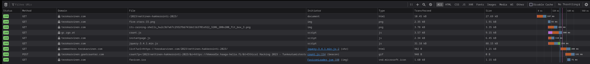

# H0 Alkutestaus

Avasin F12 Firefoxin kehittäjätyökalut

Sieltä näkee että ensimmäisenä lataa HTML tiedoston ja kuvat, sen jälkeen lataa Goat counter skriptin joka on käyttäjien seuraamiseen tarkoitettu,
tuplaklikkaamalla saa auki skriptin koodin. Instantpage.js lataa sivun jonka päällä käyttäjän kursori on lataamalla sen sisällön ennen kuin käyttäjä on klikannut sivua.

Vasemmalla näkyy koodi 200 joka kertoo että pyynnöt onnistuivat. 

Kaikki paitsi yksi pyyntö oli teron domainille, gc.zgo.at liittyi juuri tuohon Goat counteriin. comment.terokarvinen.com oletettavasti liittyy sivun kommentointi ominaisuuteen.
