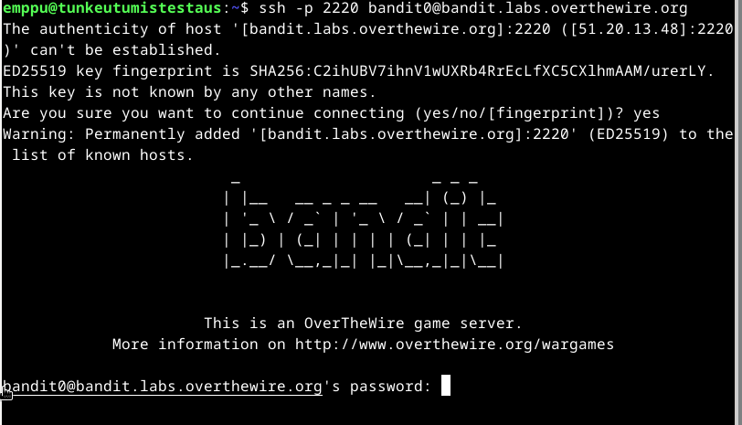
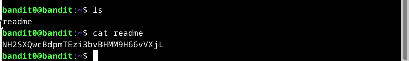
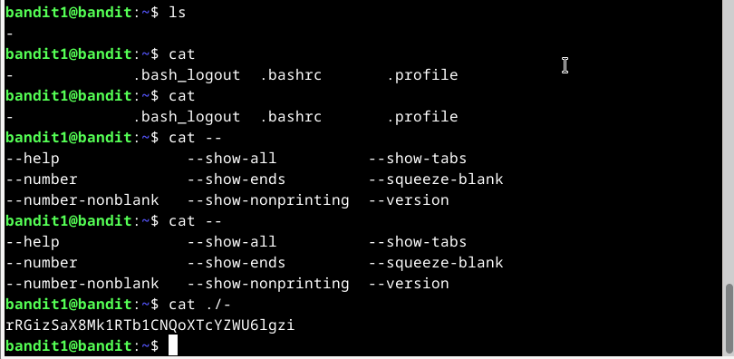
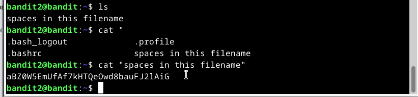
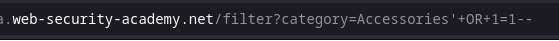
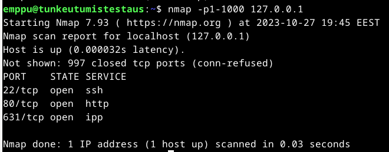
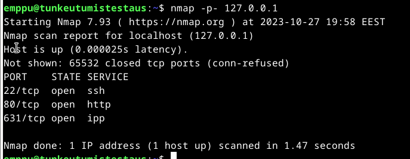
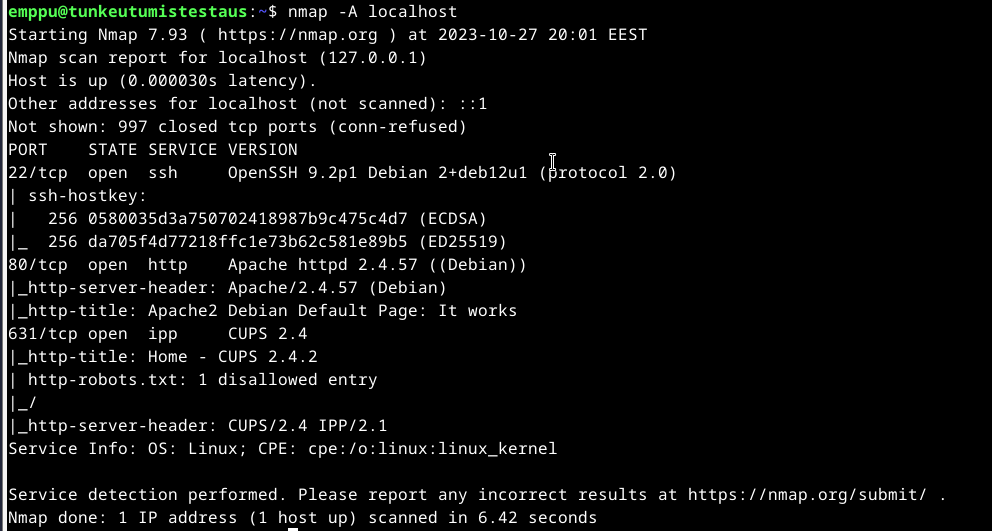
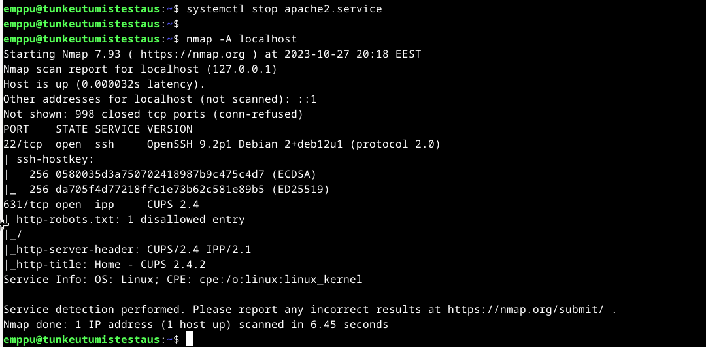
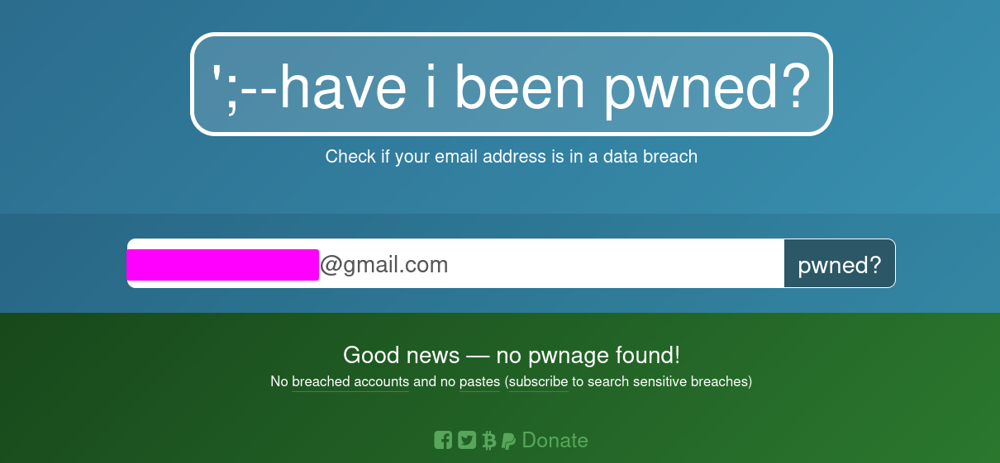

# h1 hacker warmup

## x)  Lue/katso ja tiivistä.

### Active reconnaissance 

-Aloitetaan porttiskannauksella

-Web palveluiden arvioiminen mistä kannattaa aloittaa haavoittuvuuksien löytäminen

-Haavoittuvuuksien kartoittaminen 

### Työkaluja porttienskannaukseen, web palveluiden arvioimiseen ja haavoittuvuuksien kartoittamiseen

#### Porttiskannaus

-Nmap

https://nmap.org/

-Masscan

https://github.com/robertdavidgraham/masscan

-Udpprotoscanner(?)

#### Web palveluiden arvioiminen

-EyeWitness

https://github.com/RedSiege/EyeWitness

#### Haavoittuvuuksien kartoittaminen

##### Verkon

-OpenVas

-Nessus

-Nexpose

-Qualys

-Nmap

##### Webin

-Nitko

-WPScan

-SQLMap

-Burp Suite

-Zed Attack Proxy

### Intrusion Kill Chain.

1. Kohteen tiedustelu, esimerkiksi verkkosivut, emailit, mitä teknologioita käytössä.

2. Aseistaminen, Etäkäyttötroijalaisen yhdistäminen esimerkiksi PDF tiedostoon tai muuhun tiedostoon joka avataan kohdejärjestelmässä.

3. Toimittaminen, Aseistetun kuorman toimittaminen kohdejärjestelmään, sähköpostiliitteet ja USB tikut yleisiä.

4. Kuorman aktivointi, Usein kohdistuu haavoittuvuuteen sovelluksessa, mutta voi myös olla käyttäjän
 manipulointia avaamaan esimerkiksi PDF tiedosto, tai käyttää haavoittuvuutta käyttöjärjestelmässä joka automaattisesti aktivoi kuorman.

5. Pysyvän pääsyn kohdejärjestään varmistaminen, asentamalla takaportin.

6. Komento ja kontrolli(C2), Yleisesti haavoittuneiden kohdejärjestelmien pitää ilmoittaa ulkopuolella olevalle palvelimelle saavuttaakseen C2 kanavan. 
Kun C2 yhteys on varmistettu kohdejärjestelmään hyökkääjillä on pääsy kohdejärjestelmään.

7. Tavoitteiden toteutus, hyökkääjät voivat toteuttaa halutut tavoitteet, yleisesti tiedon vieminen.

## a) Over The Wire: Bandit kolme ensimmäistä tasoa

### Level 0: 

Pitää ottaa yhteys SSH:lla portista 2220, käyttäjänimi bandit0 ja salasana bandit0.

### Level 1:

Löytyy tiedosto nimeltä README, cat:illa printtasin sen sisällön ja löysin salasanan bandit1 käyttäjälle.

### Level 2: 

Pitää ottaa yhteys SSH:lla portista 2220, käyttäjänimi bandit1.

Löytyy tiedosto nimeltä "-" ja sen sisällä on salasana käyttäjälle bandit2, sen avaamiseen jouduin hakemaan googlesta apua ja selvisi laittamalla ./ eteen se avautuu.

### Level 3: 

Pitää ottaa yhteys SSH:lla portista 2220, käyttäjänimi bandit2.

Löytyy tiedosto nimeltä "spaces in this filename", cat:illa printtasin sen sisällön laittamalla lainaukset ympärille ja löysin salasanan bandit3 käyttäjälle.

## b) Challenge OSINT tehtävä Where was this picture taken

Siellä oli neljä kuvaa, ensimmäisen kuvan sijainnin saa googlamalla Ravintolan nimen ja vertaamalla 
kuvia, vastaus Las Vegas, Toisessa kuvassa sanoisin olevan oikea eiffel torni ympäristöstä näkee esimerkiksi lamppujen muotoilua joka vastaa muihin eiffel tornista löytyviin kuviin.
Kolmannessa kuvassa on Blackpool Tower ja neljäs kuva löytyy hakukoneella ja sijoittuu Pakistaniin. 

## c) Ratkaise PortSwigger Labs

Ratkaisun sai avaamalla kategorian ja lisäämällä arvon "'+OR+1=1--" selaimeen.

## d) Asenna Linux virtuaalikoneeseen. 

Loin uuden Virtuaalilevy QEMUlla, -f määritellään formaatti qcow2 on QEMUn oma formaatti, annoin nimeksi "tunkeutumistestaus.qcow2" ja määrittelin sen kooksi 40 Gigatavua

	qemu-img create -f qcow2 tunkeutumistestaus.qcow2 40G

Latasin Debian 12 ja asensin se virtuaalilevylle. Aluksi määritellään komennolla "qemu-system-x86_64" että kone käynnistyy x86_64 arkkitehtuurissa, "-boot d -cdrom debian-12.2.0-amd64-netinst.iso" kertoo qemulle että ei käynnistetä kovalevyltä vaan lataamastani ISO tiedostosta(Voi myös laittaa URLin jossa ISO on), "-hda tunkeutumistestaus.qcow2" kertoo mille virtuaalikovalevylle ja "-m 4G" kertoo että koneella on 4Gt. muistia.

	qemu-system-x86_64 -boot d -cdrom debian-12.2.0-amd64-netinst.iso -hda tunkeutumistestaus.qcow2 -m 4G

Olen luonut simppelin skriptin QEMUn VM käynnistämiseen ja scriptien pyöritys onnistuu seuraavalla komennolla jos sille on annettu oikeudet (chmod +x tiedostonimi.)

	./launch_vm.sh

### e) Porttiskannaa 1000 tavallisinta tcp-porttia omasta koneestasi (localhost). 

Aluksi asensin Nmap:in.

	sudo apt install nmap 

Sen jälkeen pystyin pyörittämään joka skannaa portit 1 - 1000.

	nmap -p1-1000 127.0.0.1

Alkuun kertoo millä versiolla ajettin ja mihin aikaan.
Mitä osoitetta skannattiin.
Skannattavan kohteen status.
Kertoo suljettujen porttien määrän.

22/tcp ssh:n portti

80/tcp on http portti olin linuxin asentamisen yhteydessä ilmeisesti asentanut Apachen.

631/tcp on printterin portti nmapin sivujen mukaan(Nmap Script cups-info.)

### f) Porttiskannaa kaikki koneesi (localhost) tcp-portit.

Antoi saman tuloksen mutta suljettujen porttien määrä on suurempi ja aikaa kesti 1.47 sekunttia kun 1000 portin skannaamisessa meni 0.03 sekunttia.

### g) Tee laaja porttiskanaus (nmap -A) 

Kertoo enemmän tietoja palveluista, esimerkiksi SSH:n version ja julkiset avaimet, httpstä kertoo palvelimen ja sivujen titlen,
CUPSista kertoo version ja myös sen että sillä on käyttöliittymä johon pääsee verkkoselaimesta localhost:631.

### h) Asenna ja käynnistä jokin palvelin (apache, ssh...) koneellesi.  Vertaile, miten porttiskannauksen tulos eroaa.

Olin jo asentanut Apachen aikaisemmin joten otan sen pois päältä ja vertaan 

Siinä näkyy samat tiedot lukuunottamatta porttia 80/tcp ja sen tietoja.

### i) Kokeile ja esittele jokin avointen lähteiden tiedusteluun sopiva weppisivu tai työkalu. 

https://haveibeenpwned.com/

Sieltä pystyy tiedustelemaan onko esimerkiksi oma sähköpostiosoite tai salasana vuotanut verkkoon. 

## Lähteet:

Karvinen 2023: https://terokarvinen.com/2023/eettinen-hakkerointi-2023/

Hutchins 2011: https://lockheedmartin.com/content/dam/lockheed-martin/rms/documents/cyber/LM-White-Paper-Intel-Driven-Defense.pdf

Santos et al: https://learning.oreilly.com/videos/the-art-of/9780135767849/9780135767849-SPTT_04_00

overthewire bandit game: https://overthewire.org/wargames/bandit/bandit0.html
https://stackoverflow.com/questions/42187323/how-to-open-a-dashed-filename-using-terminal

portswigger lab: https://portswigger.net/web-security/sql-injection/lab-retrieve-hidden-data

man qemu

Debian wiki QEMU: https://wiki.debian.org/QEMU

Debian Netinst ISO: https://www.debian.org/distrib/netinst

man nmap

Nmap Port Specification and Scan Order: https://nmap.org/book/man-port-specification.html

Nmap Script cups-info: https://nmap.org/nsedoc/scripts/cups-info.html

haveibeenpwned: https://haveibeenpwned.com/

