# H2 Sniff-n-Scan

Harjoitukset tehty QEMUlla jossa pyörii Debian 12 jolle määritelty 4Gt. Muistia. 

Host koneen rauta:

Käyttöjärjestelmä - Debian 12 Bookworm

CPU - AMD Ryzen 7 7800X3D 

GPU - AMD ATI 7900 XTX

RAM - 32Gt.

## x) Lue/katso ja tiivistä.

### 0x03 Still Fuzzing Faster (U Fool) - joohoi - HelSec Virtual meetup #1

FFUF - Työkalu avoimien verkkosivujen löytämiseen, jotka ei ole esimerkiksi linkitettynä sivuilla.

Pystyy tulkitsemaan poikkeuksia palvelimen vastauksissa

Avoimen lähdekoodin ohjelma jonka ansiosta kehitys haluamaan suuntaan helpompaa kuin esimerkiksi Burp Suiten

### Nmap - Port Scanning Basics

#### Open 

Portti on avoinna ja ohjelma kuuntelee porttia. 

#### Closed

Portti on avoinna mutta ohjelma ei kuuntele porttia.

#### Filtered

Nmap ei pysty tulkitsemaan onko portti avoinna vai ei koska paketit filtteröidään esimerkiksi palomuurin toimesta.

### Nmap - Port Scanning Techniques

#### -sS

Default skannaus tyyppi jos oikeudet sallivat sen.

Puoliksi avoin skannaus ei viimeistele kolmitiekättelyä, lähettää SYN pyynnön ja katsoo tuleeko SYN/ACK vastaus mutta ei lähetä kolmatta kättelyä eli ACKta takaisin.

#### -sT

Default skannaus tyyppi jos oikeudet eivät salli -sS komentoa.

Kokonainen skannaus joka viimeistelee kolmitiekättelyn, nmap tulkitsee rajapinnan vastauksesta onko portti auki. Verrattavissa pyyntöihin joita esimerkiksi selaimet lähettää.

#### -sU

UDP skannaus. 

UDP portit eivät usein lähetä vastausta joten tulkitseminen onko portti auki vai ei on vaikeampaa.

Jos palvelin lähettää vastauksen portti luokitellaan avoimeksi open, jos palvelin ei lähetä vastausta portti luokitellaan open|filtered, jos palvelin vastaa ICMP unreachable portti luokitellaan filtered.

### a) Fuff. Ratkaise Teron ffuf-haastebinääri.

Asensin teron harjoitushaasteen.

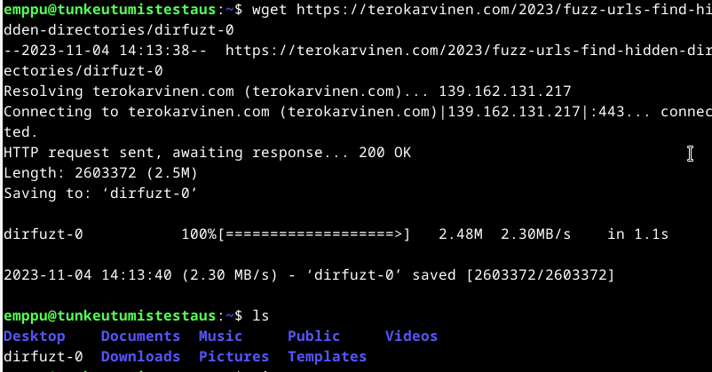

Asensin fuffin

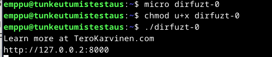

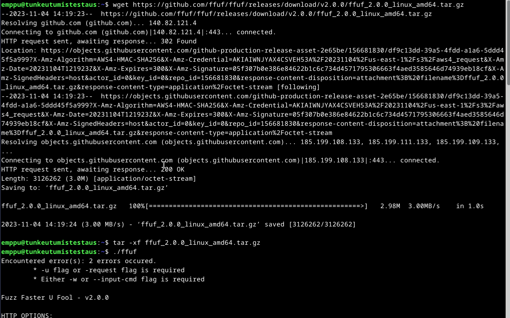

Testailin harjoitusta.

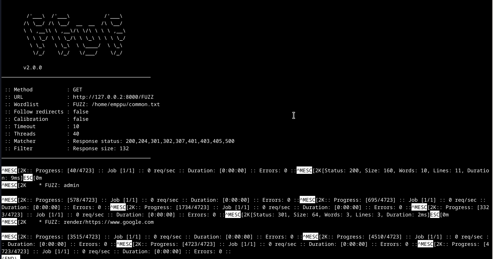

Asensin haasteen ja käynnistin sen:

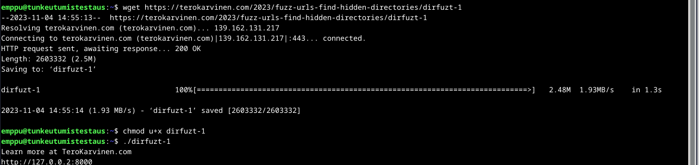

Testasin komennolla, ./fuff kertoo mikä ohjelma, -w kertoo sanalistan , -u kertoo urlin tässä tapauksessa http://127.0.0.2:8000/FUZZ

	./fuff -w common.txt -u http://127.0.0.2:8000/FUZZ |&less

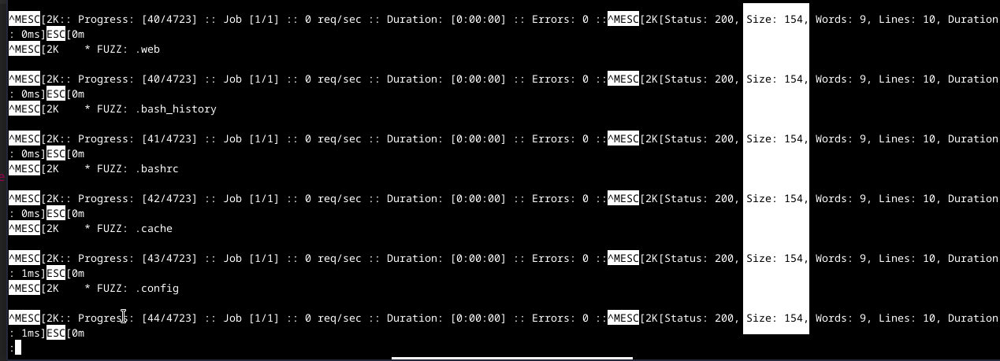

Huomaan tulosteesta että default 200 vastauksen koko on 154 tavua joten kokeilin filtteröidä sen:

	./fuff -w common.txt -u http://127.0.0.2:8000/FUZZ -fs 154 |&less

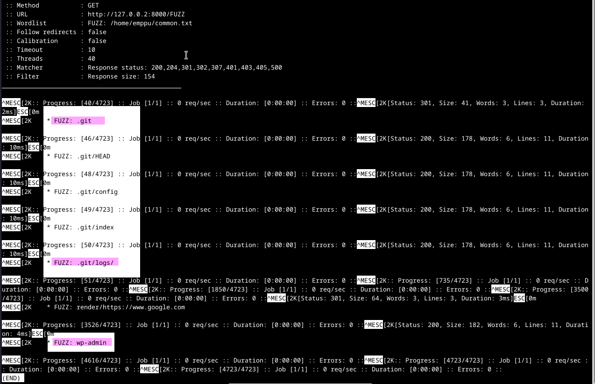

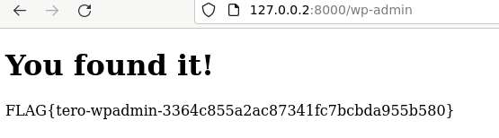

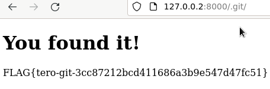

### b) Fuffme. Asenna Ffufme harjoitusmaali paikallisesti omalle koneellesi. Ratkaise tehtävät 

Asensin fuffme harjoituksen, asennuksessa oli paljon eri komentoja joissa oli paljon tulosteita niin näytän vain historian ja lopputuloksen asennuksesta.

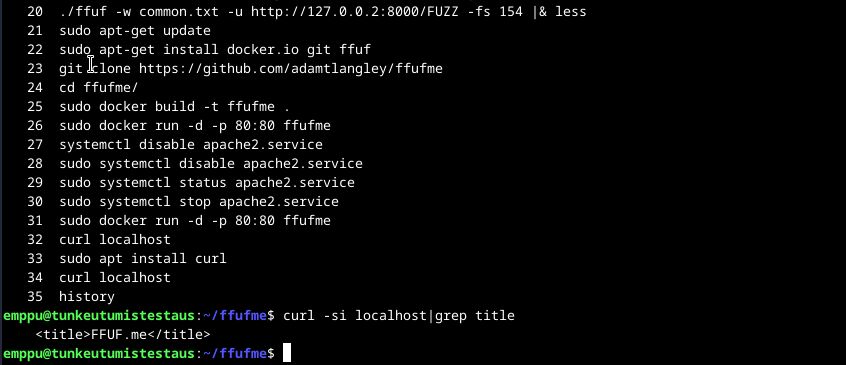

### Basic Content Discovery

Kokeilee urlissa kaikki listassa olevat rivit korvaten FUZZin halutulla sanalla.

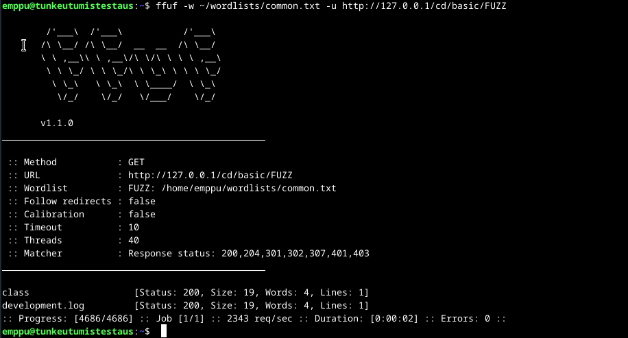

### Content Discovery With Recursion

Kokeilee urlissa kaikki listassa olevat rivit korvaten FUZZin halutulla sanalla, sekä alahakemistot

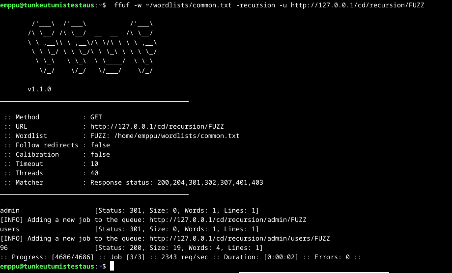

### Content Discovery With File Extensions

Etsii kaikki .log nimiset tiedostot.

### No 404 Status

Filtteröidään 669 tavuset sivut tuloksista.

### Param Mining

Toimii samalla tavalla kuten aikaisemmat mutta eri sanalista ja kohta URLissa.

#### Rate limited

Kokeilin ohjeessa ollutta komentoa , huomasin että ohjeessa oli fuff.test laitettu domainiksi joten vaihdoin sen localhostissa olevaan.

	ffuf -w ~/wordlists/common.txt -u http://127.0.0.1/cd/rate/FUZZ -mc 200, 429

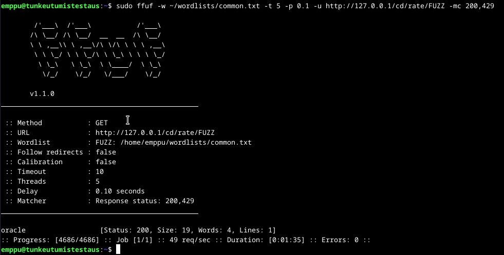

### Subdomains - Virtual Host Enumeration

Hakee subdomaineja ja filtteröi 1495 tavuiset tulokset.

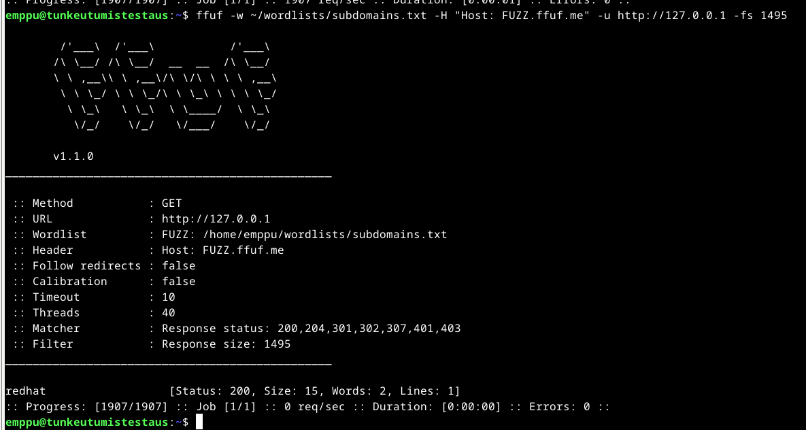

### c) nmap TCP connect scan -sT

Käynnistin Wiresharkin komennolla ja valitsin interfaceiksi loopbackin

	wireshark

Laitoin seuraavan komennon, laitoin 127.0.0.2 jotta wiresharkin tulostetta on helpompi tulkita.

	sudo nmap -sT 127.0.0.2

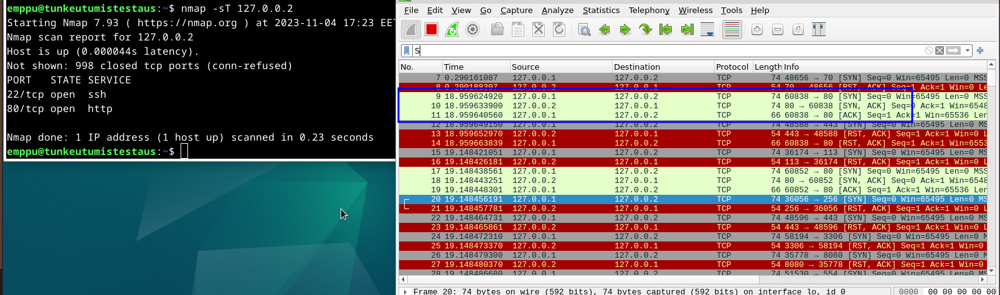

Sieltä pystyy lukemaan että 127.0.0.1 lähettää porttiin 80 osoitteessa 127.0.0.2 SYN ja se vastaa SYN, ACK ja 127.0.0.1 vastaa ACK viimeistellen kolmitiekättelyn. portit jotka eivät ole kuuntelemassa vastaavat RST, ACK.

### d) nmap TCP SYN "used to be stealth" scan, -sS 

Laitoin seuraavan komennon, laitoin 127.0.0.2 jotta wiresharkin tulostetta on helpompi tulkita.

	sudo nmap -sS 127.0.0.2

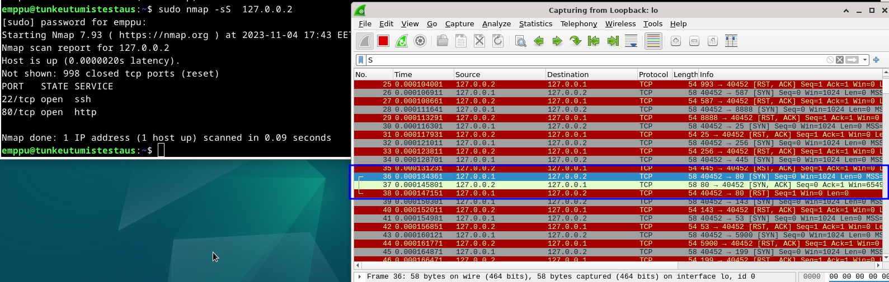

Sieltä pystyy lukemaan että 127.0.0.1 lähettää porttiin 80 osoitteessa 127.0.0.2 SYN ja se vastaa SYN, ACK ja 127.0.0.1 katkaisee yhteyden RST.

### e) nmap ping sweep -sn

Laitoin seuraavan komennon

	sudo nmap -sn localhost

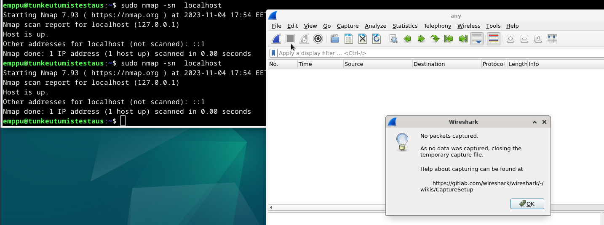

Nmap skannaa että host on ylhäällä mutta wireshark ei skannannut mitään trafiikkia vaikka olin valinnut filteriksi any, en löytänyt googlella oikein kunnollista vastausta että miksi? Oma veikkaukseni on että koska skannaan localhostia niin nmap ei lähetä mitään verkon kautta.

### f) nmap don't ping -Pn
 
Annoin komennon 

	sudo nmap -Pn 127.0.0.2

Antaa saman vastauksen kuin aikaisemmin tehty -sS komento.

	sudo nmap -sS 127.0.0.2

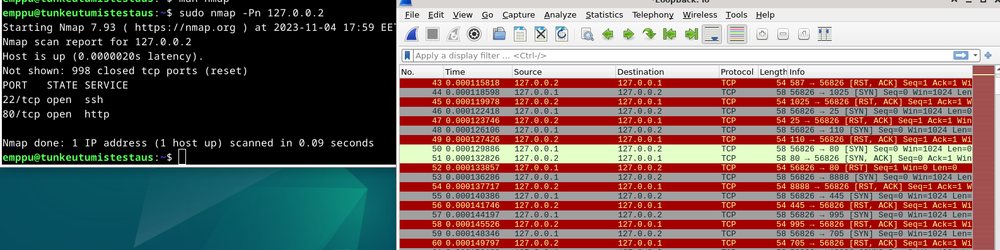

### g) nmap version detection -sV (esimerkki yhdestä palvelusta yhdessä portissa riittää)

Annoin komennon 

	sudo nmap -sV -p80 127.0.0.2

Antaa alkuun saman vastauksen kuin -sS sen jälkeen se pyytää lisää tietoa http rajapinnan avulla.

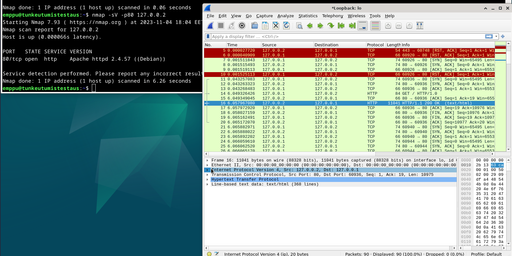

### h) nmap output files -oA foo. Miltä tiedostot näyttävät? Mihin kukin tiedostotyyppi sopii?

	sudo nmap -oA foo localhost

loi kolme uutta tiedostoa skannauksen lisäksi, tiedostoissa on tiedot skannauksesta.

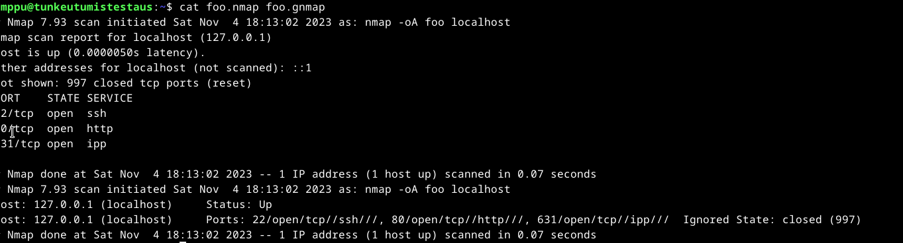

.nmap tiedosto on identtinen nmapin omasta tulosteesta

.gnmap tiedosto on "Grepable Output", siinä monet tiedot eivät ole eri rivilla jolloin putkien kautta grepillä viu vetää helpommin tietoa

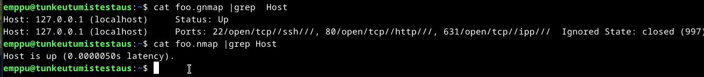

.xml tiedosto laittaa nmaping tulostuksen muotoon joka on helpompi muille ohjelmille tulkita.
 
 
### i) nmap ajonaikaiset toiminnot (man nmap: runtime interaction): verbosity v/V, help ?, packet tracing p/P, status s (ja moni muu nappi)

-v/V verbosity kertoo enemmän tietoa

-p/P kertoo ajon aikana mitkä paketit lähtee 

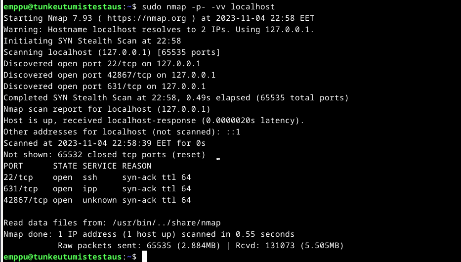
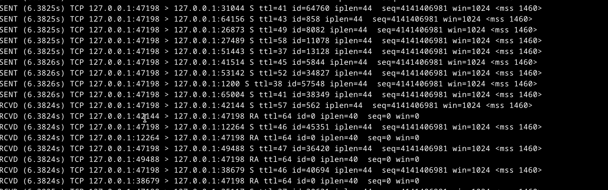

s status kertoo sen hetkisen statuksen mitä ajetaan.

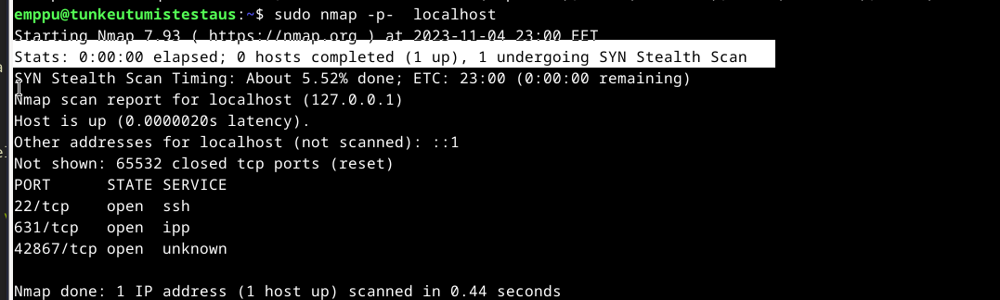

### j) Ninjojen tapaan. Piiloutuuko nmap-skannaus hyvin palvelimelta? 

avasin apache2 palvelimen lokit ja ajoin nmap komennon joka tarkistaa version ja ilman version tarkistusta.

	sudo tail -f /var/log/apache2/access.log

	sudo nmap -p80 -sV localhost

	sudo nmap -p80 localhost

Version tarkistuksesta jää merkintä logeihin mutta pelkästä default skannauksesta ei jäänyt.

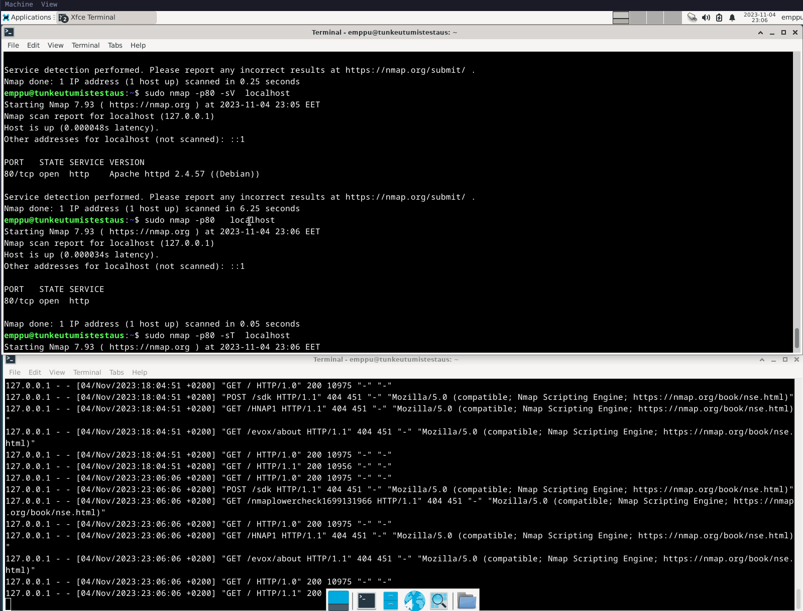

### k) UDP-skannaus. UDP-skannaa paikallinen kone (-sU). 

Skannasin kaikki portit sekä ainoastaa 631, wiresharkin tulosteesta näkee että suljetut portit vastaavat ICMP unreachable, kun taas avoinna olevat portit eivät vastaa mitään.

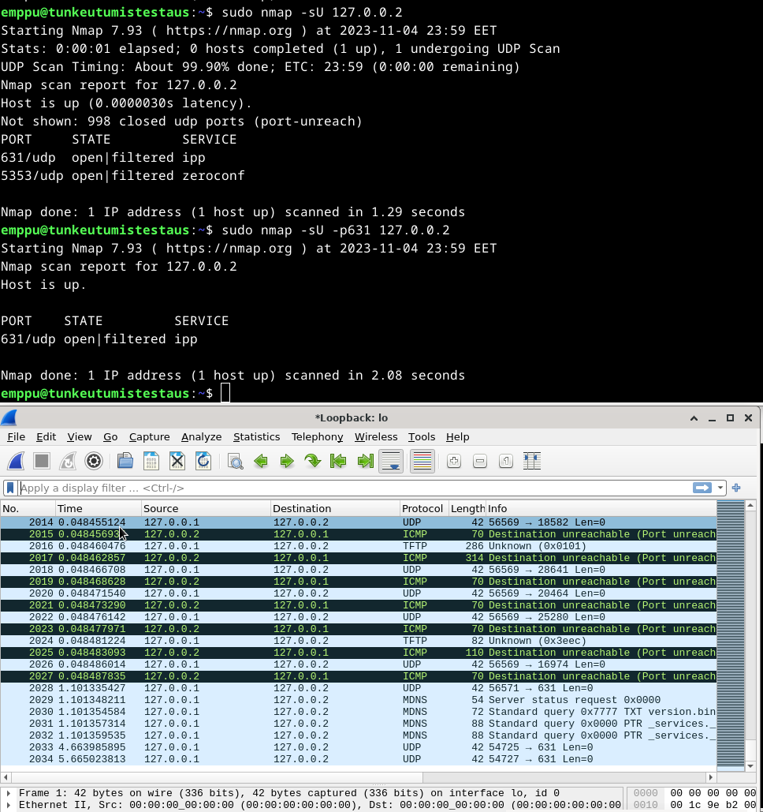

### l) Miksi UDP-skannaus on hankalaa ja epäluotettavaa? 

UDP skannauksessa ei usein tule vastausta palvelimelta ja se voi tarkoittaa että portti on auki tai että se on palomuurin takana. 

Jos portti on suljettu palvelin voi lähettää ICMP unreachable viestin tai  olla lähettämättä. 

Jos portti on palomuurin takana voi se lähettää ICMP unreachable viestin tai olla lähettämättä.

## Lähteet: 

Fuffme - Install Web Fuzzing Target on Debian, Karvinen 2023: https://terokarvinen.com/2023/fuffme-web-fuzzing-target-debian/

Ethical Hacking 2023, Karvinen 2023: https://terokarvinen.com/2023/eettinen-hakkerointi-2023/

0x03 Still Fuzzing Faster (U Fool) - joohoi - HelSec Virtual meetup #1: https://www.youtube.com/watch?v=mbmsT3AhwWU

Port Scanning Basics: https://nmap.org/book/man-port-scanning-basics.html

Port Scanning Techniques: https://nmap.org/book/man-port-scanning-techniques.html

https://raw.githubusercontent.com/danielmiessler/SecLists/master/Discovery/Web-Content/common.txt

Grepable Output (-oG): https://nmap.org/book/output-formats-grepable-output.html
