# H3 - Lab kid

## x) Lue/katso ja tiivistä. 

En onnistu katsomaan oreillyn sivuilla olevaa videota koska se vaatii käyttäjän ja 10 päivän kokeilu oli päättynyt, koitin luoda uuden käyttäjän mutta antaa virheilmoituksen.

Katsoin "SQL Injecting Beyond Strict Filters - Union Without Comma"

Siinä kerrotaan SQL injektiosta, miten se tapahtuu ja myös kerrotaan miten se korjataan ja mitigoidaan.

## a) Asenna Kali virtuaalikoneeseen

Latasin QEMU levykuvan Kalin sivuilta, se on live kuva niin asennusta ei tarvitse. 

## b) Asenna Metasploitable 2 virtuaalikoneeseen

Latasin metasploitable 2 vmware levykuvan rapid7 sivuilta koska qemu levykuvaa ei ollut saatavilla ja muutin sen QEMUlle sopivaksi qcow2 kuvaksi QEMUn omalla työkalulla.

	qemu-img convert -p -f vmdk -O qcow2 ./Metasploitable.vmdk ./Metasploitable.qcow2

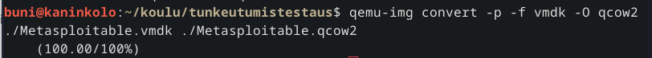

## c) Tee koneille virtuaaliverkko

Tein uuden skriptin aiemmin luomasta käynnistys scriptiä ja muokkasin sitä käynnistämään molemmat koneet samaan aikaan ja että se luo virtuaaliverkon VM koneiden välille jolla ei ole yhteyttä host koneeseen tai internettiin.

	#!/bin/bash
	
	METASPLOIT2="Metasploitable.qcow2"
	KALI="kali-linux-2023.3-qemu-amd64.qcow2"
	
	#Net 
	NETDEV_ID="mynet0"
	SOCKET_PORT="6996"
	
	#Muisti
	MEM_SIZE_KALI=4096
	MEM_SIZE_METASPLOIT=1024
	
	#Metasploit VM
	qemu-system-x86_64 \
	    -drive file=$METASPLOIT2,format=qcow2 \
	    -m $MEM_SIZE_METASPLOIT \
	    -enable-kvm \
	    -cpu host \
	    -netdev socket,id=$NETDEV_ID,listen=:${SOCKET_PORT} \
	    -device e1000,netdev=$NETDEV_ID & 
	
	#Kali VM
	qemu-system-x86_64 \
	    -drive file=$KALI,format=qcow2 \
	    -m $MEM_SIZE_KALI \
	    -enable-kvm \
	    -cpu host \
	    -netdev socket,id=$NETDEV_ID,connect=:${SOCKET_PORT} \
	    -device e1000,netdev=$NETDEV_ID 
	
VMillä ei ole dhcp palvelinta antamassa ip osoitteita joten jotta saan yhteyden toiseen koneeseen annan niille ip osoitteet.

EDIT: myöhemmin löysin myös että qemu:lla on mahdollisuus luoda dhcp palvelin(-netdev dhcpstart) jolla voi antaa ip-osoitteet mutta kaikki tehtävät on tehty käsin antamilla ip-osoitteilla.

	sudo ip addr add 192.168.100.x/24 dev eth0

	sudo ip link set eth0 up

 192.168.100.2 - Metasploitable2
 
 192.168.100.3 - Kali

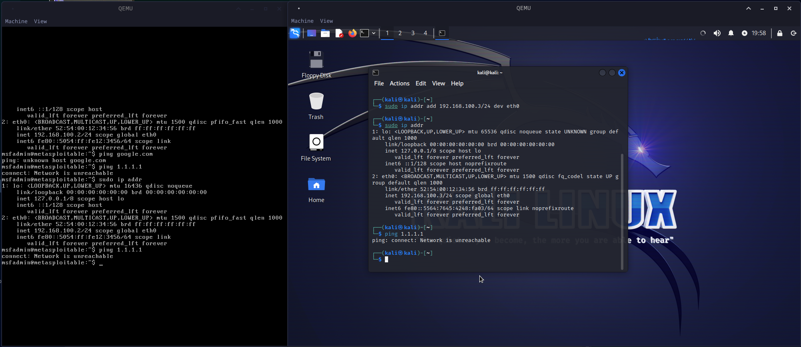

## d) Etsi Metasploitable porttiskannaamalla (db_nmap -sn). 

Aluksi käynnistin postgres palvelimen ja alustin tietokannan, sen jälkeen käynnistys onnistui ja pystyin skannaamaan kaikki ip osoitteet ping sweepillä.

	sudo systemctl start postgres

	sudo msfdb init

	msfconsole

	db_nmap -sn  192.168.100.1/24

laittamalla 192.168.100.1/24 käy läpi kaikki ip osoitteet 192.168.100.1 - 254. 

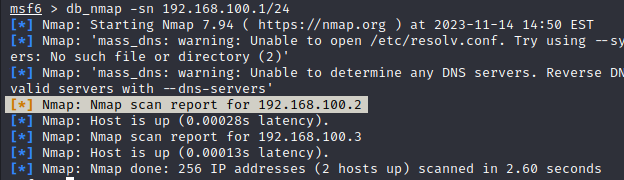

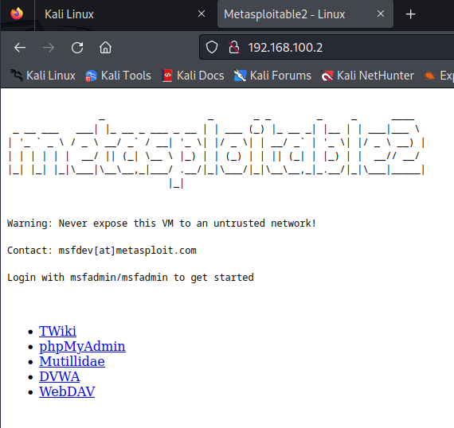

Tiesin jo koneen ip osoitteen koska annoin sen käsin mutta hyvä varmistaa.

## e) Porttiskannaa Metasploitable huolellisesti (db_nmap -A -p0-). Analysoi tulos. Kerro myös ammatillinen mielipiteesi (uusi, vanha, tavallinen, erikoinen), jos jokin herättää ajatuksia.

Skannauksesta selviää että todella moni palvelu on käynnissä ja portti on auki ja jokin ohjelma kuuntelee porttia esimerkiksi:  Vsftpd pyörii versiossa 2.3.4 ja Apache versiossa 2.2.8 molemmat haavoittuvaisia versioita hyökkäyksille. SSL sertifikaatit ovat vanhentuneet vuonna 2010.
Portissa 1524 on bindshell josta saa suoran yhteyden shelliin niin sanottu backdoor.

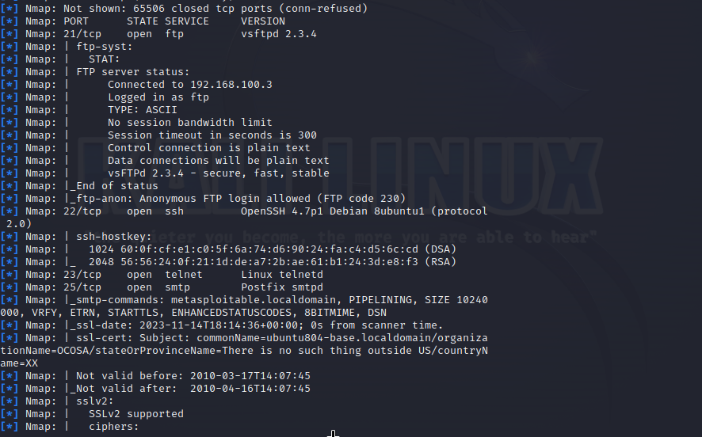

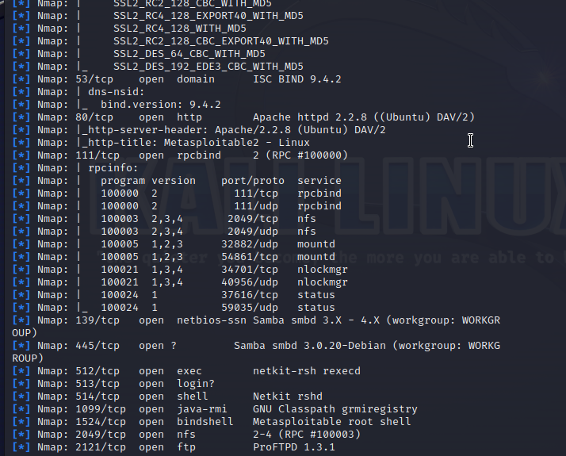

## f) Murtaudu Metasploitablen VsFtpd-palveluun Metasploitilla (search vsftpd, use 0, set RHOSTS - varmista osoite huolella, exploit, id)

	db_nmap -A -p0-

jälkeen 

	search vsftpd

	use 1

	set RHOSTS 192.168.100.2

	exploit

	
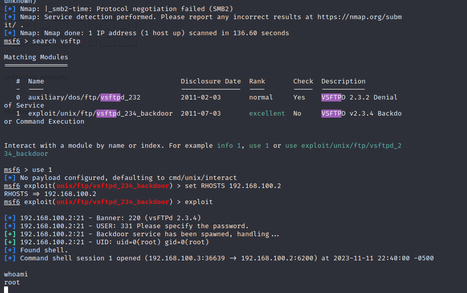

## g) Parempi sessio. Tee vsftpd-hyökkäyksestä saadusta sessiosta parempi. (Voit esimerkiksi päivittää sen meterpreter-sessioksi, laittaa tty:n toimimaan tai tehdä uuden käyttäjän ja ottaa yhteyden jollain tavallisella protokollalla)

Tein aluksi uuden käyttäjän ja annoin sille sudo ja admin oikeudet, kun yritin kirjautua ssh:lla selvisi että metasploit kone antaa ottaa ssh yhteyden ainoastaan avaimilla. Koitin tämän jälkeen muokata /etc/ssh/sshd_config mutta se kaatoi session, koitin muokata nano:lla jota veikkaisin syypääksi miksi sessio kaatui. 

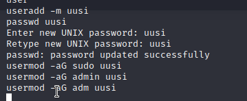

Lopulta päädyin kokeilemaan session muuttamista meterpreter sessioksi, ctrl-z laitoin session background sessioksi eli yhteys pidetään päällä metasploitableen, etsin meterpreterin valitsin sen ja run. Sen jälkeen pystyin valitsemaan meterpreter session.

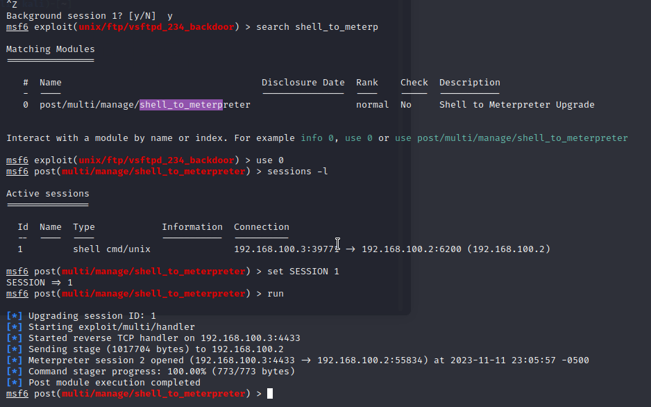
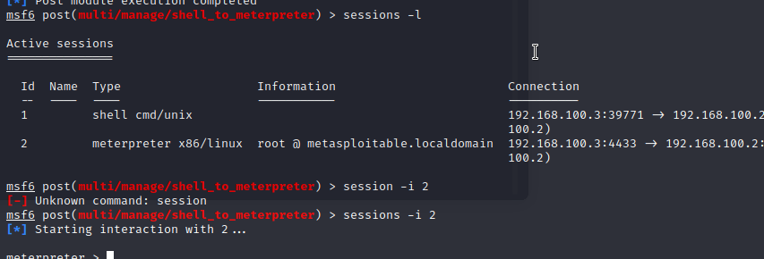

## h) Etsi, tutki ja kuvaile jokin hyökkäys ExploitDB:sta. (Tässä harjoitustehtävässä pitää hakea ja kuvailla hyökkäys, itse hyökkääminen jää vapaaehtoiseksi lisätehtäväksi)

Otin tälläisen koska olen joskus itsekkin harkinnut pyörittävän Gitea palvelimilla: "Gitea 1.16.6 - Remote Code Execution (RCE) (Metasploit) ", Gitea on suosittu Gitin hostauspalvelu ja siinä on ollut exploitti fetch komennossa joka sallii ei halutun koodin pyörittämisen palvelimella(Remote code execution)
RCE:t backdoorien asettamisen palvelimelle hyökkääjällä olisi mahdollisuus tehdä mitä haluaa palvelimella.

## i) Etsi, tutki ja kuvaile hyökkäys 'searchsploit' -komennolla. Muista päivittää. (Tässä harjoitustehtävässä pitää hakea ja kuvailla hyökkäys, itse hyökkääminen jää vapaaehtoiseksi lisätehtäväksi. Valitse eri hyökkäys kuin edellisessä kohdassa.)

Päivittäminen ei onnistu koska koneella ei ole internet yhteyttä, hain tomcat 5.5.0 palvelimeen liittyviä hyökkäyksia koska metasploitissa pyörii kyseinen versio ja Javalla koodatessa web applikaatioita tulee käytettyä myös tomcat palvelinta.

	searchsploit tomcat 5.5.0

Sen jälkeen kun löysin exploitteja niin en tiennyt mistä se saa auki mutta pienen googlailun jälkeen sain tietää että hakemisto josta exploitit ja niiden kuvaukset löytyy sijaitsee /usr/share/exploitdb/exploits/(searchsploitin antama hakemisto)

	cat /usr/share/exploitdb/exploits/multiple/remote/12343.txt | less

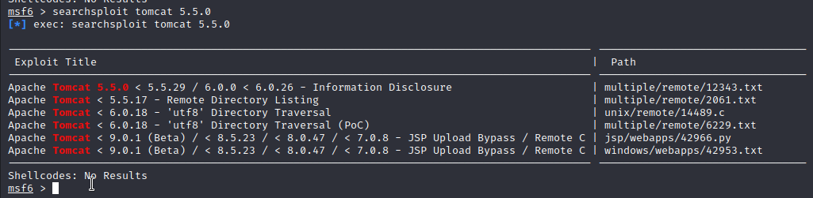

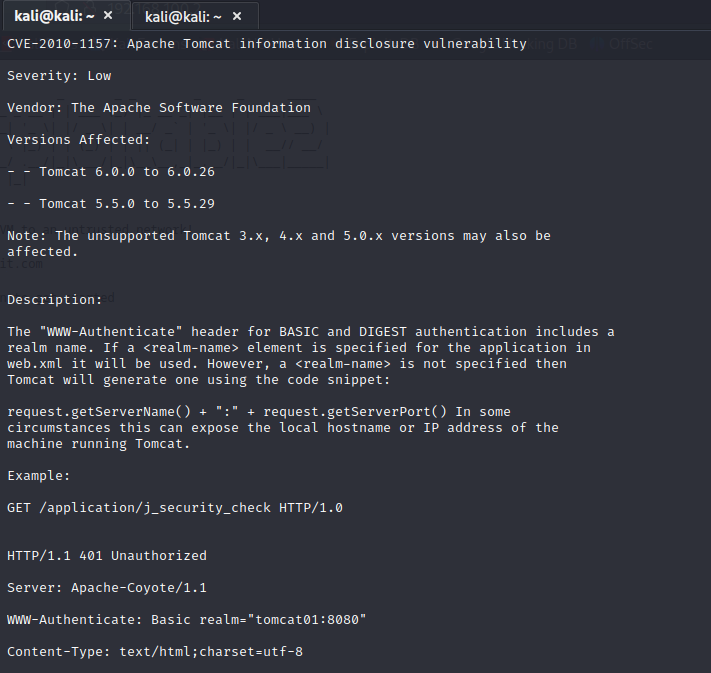

Ihan alkuun on CVE numero joka joka toimii exploitin tunnistamiseen. Sen jälkeen kerrotaan kuinka vakava exploit on tässä tapauksessa on arvioitu alhaiseksi eli LOW.

Sen jälkeen kerrotaan miten hyökkäys toimii ja mitä sillä saadaan aikaan, tässä tapauksessa jos on jäänyt konfiguroimatta Javan web applikaation realm nimi se antaa defaultti vastauksena koneen host nimen ja portin jossa tomcat pyörii. 
Arvioisin että hyökkäys ei ole luokiteltu vakavaksi koska se vaatii konfiguraatio virheen palvelimen asennuksessa ja tiedot jota hyökkäyksellä saadaan eivät itsessään anna pääsyä koneeseen tai tietoihin.

## j) Kokeile vapaavalintaista haavoittuvuusskanneria johonkin Metasploitablen palveluun. (Esim. nikto, wpscan, openvas, nessus, nucleus tai joku muu)

Kokeilin listasta ensimmäistä skanneria eli  niktoa, sen pyörittäminen onnistui helposti.

	nikto -host 192.168.100.2 

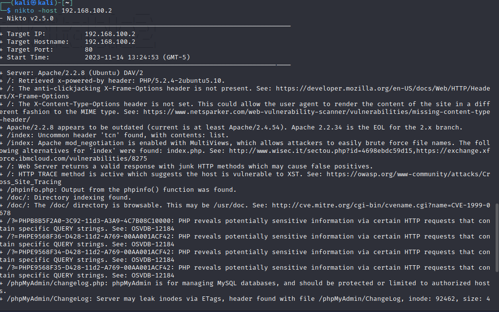
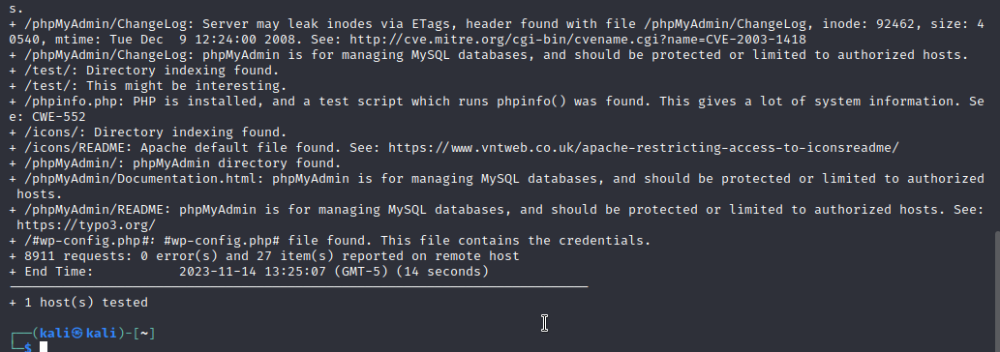

Se paljastaa monia eri haavoittuvuuksia koneen konfiguroinnista esimerkiksi että tietokantaa ei ole suljettu ulkopuolisilta käyttäjiltä ja osasi myös kertoa mistä löytyy palvelimen avaimet/pääsytiedot(credentials.)

## Lähteet:

https://wiki.qemu.org/Documentation/Networking

https://wiki.qemu.org/Documentation/Networking#Socket

https://askubuntu.com/questions/110735/how-do-i-set-a-static-ip-address

http://downloads.metasploit.com/data/metasploitable/metasploitable-linux-2.0.0.zip

https://www.vinchin.com/en/blog/convert-vmdk-to-qcow2.html

https://infosecwriteups.com/metasploit-upgrade-normal-shell-to-meterpreter-shell-2f09be895646

Man qemu

https://docs.oracle.com/cd/E19798-01/821-1841/bnbxm/index.html

https://www.exploit-db.com/exploits/51009

https://www.youtube.com/watch?v=61kf4CEnOZk
