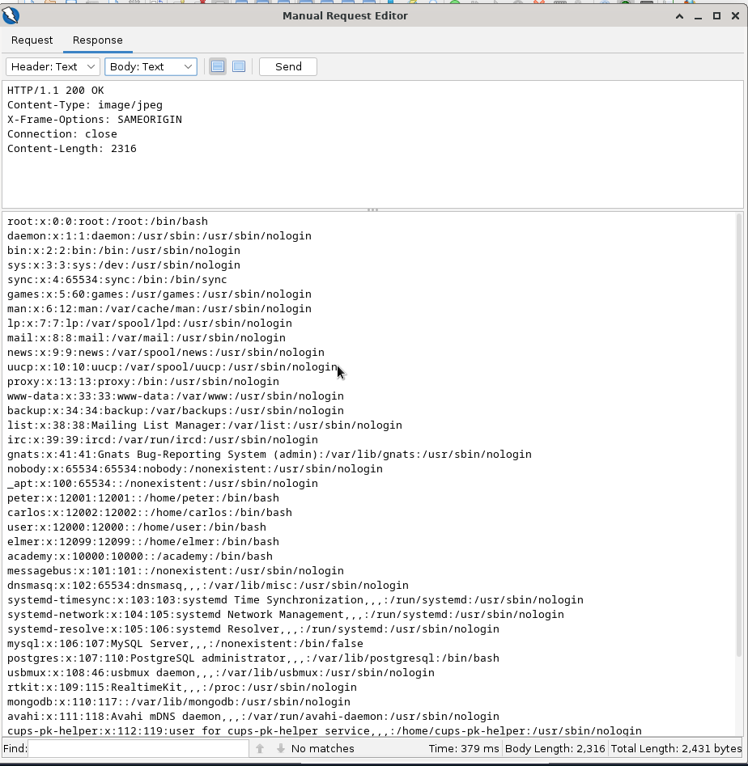
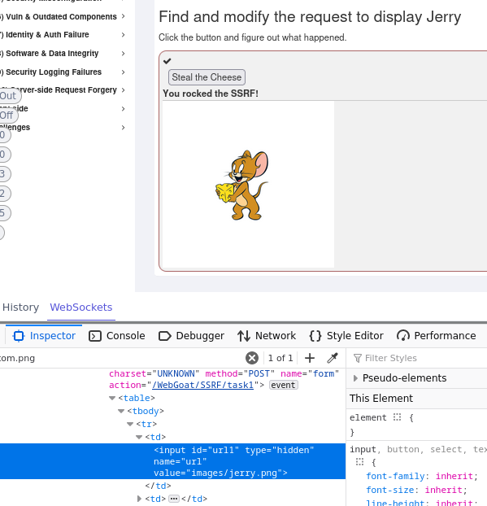

# H4 - Totally Legit Sertificate

Harjoitukset tehty QEMUlla jossa pyörii Debian 12.

## x) Lue/katso ja tiivistä. 

## a) Totally Legit Sertificate. 

Latasin ZAPin zaproxyn github sivuilta. Annoin oikeudet pyörittää asennus ohjelman (chmod +x.) Asensin myös javan 

	chmod +x ZAP

	sudo apt install openjdk-17-jre

	sudo ./ZAP

Generoin uuden sertifikaatin ZAPissa ja laitoin tämän sertifikaatin päälle Firefoxin asetuksissa.

## b) Kettumaista. Asenna FoxyProxy Standard Firefox Addon, ja lisää ZAP proxyksi siihen.

Asensin FoxyProxyn ja laitoin ohjaamaan ZAPpiin localhost:8080

## PortSwigger Labs

Moni näistä hyökkäyksistä on käyty läpi ohjelmointi kursseilla (vaikka ei portswiggerin labroissa) ja olivat tuttuja.

## c) 

Vaihdoin chatin lokin latauslinkin tiedostonimen 1.txt ja sieltä sain carlos käyttäjän salasanan

## d)

Avasin kuvan sivuilta ja muokkasin kuvan tiedosto pyyntöä että hakee ../../etc/passwd tiedoston ZAPissa, ZAPissa pitää valita että näyttää tiedoston tekstinä vaikka tiedosto on pyydetty kuvana.

## e)

Tein samanlaisen pyynnön kuin kohdassa d, mutta etsin pelkästään hakemistosta /etc/passwd

## f)
 
Tein samanlaisen pyynnön kuin kohdassa d, mutta etsin pelkästään hakemistosta ....//....//etc/passwd

## g) 

Kirjauduin harjoituksen antamalle käyttäjätunnuksille ja laitoin {%debug}, sieltä pystyin asetuksista päättelemään salaisen avaimen ja vaihtamalla tuotetietoja uudestaan {{settings.SECRETKEY}} sain vastauksen.

## h)

Avasin admin sivun mutta se ei anna kirjautua jos ei ole localhostina(loopback), avasin tuotteen ja pyysin palvelimelta varasto saldoja sen jälkeen ZAPissa pystyin muuttamaan että rajapinta kysyy localhost/admin jolloin pääsin admin sivuille

sen jälkeen kun huomasin että pääsin admin sivuille pystyin poistamaan halutun käyttäjän localhost/admin/delete?username=carlos

## i) 

Ratkaisun sai laittamalla  hakukenttään joka kertoo sen että käyttäjän inputtia ei sanitoida.

## j) 

Tein saman kuten i) mutta laitoin scriptin kommenttikenttään.

## Asenna WebGoat

Seurasin ohjeita WebGoatin github sivuilta, muutin portin 8080->8081 koska 8080 oli ZAPin käytössä

		docker run -it -p 127.0.0.1:8081:8081 -p 127.0.0.1:9090:9090 webgoat/webgoat

Tämä ei toiminut joten kokeilin muuttaa ZAPin porttia ja käynnistää uudelleen WebGoatin portissa 8080 ja sen jälkeen se toimi.

## m) (A1) Broken Access Control (WebGoat 2023.4)

hijack_cookiesta pystyy huomaamaan että numerot nousevat yrityksissä jolloin se oli vain kokeilemisesta kiinni että löytää oikean numeron, ZAPissa tulevalla fuzzerilla voi automatisoida tämän.

## n) (A7) Identity & Auth Failure (WebGoat 2023.4)

Muuttamalla kysymysten nimeä voi ohittaa ne.

Firefoxin omalla network työkalulla kun seuraa POST pyyntöjä saa vastauksen

## o) (A10) Server-side Request Forgery (WebGoat 2023.4)

muutetaan tom.jpg -> jerry.jpg

## p) Client side (WebGoat 2023.4)

Laittamalla omat arvot pyyntöön saadaan tehtävä ratkaistua.

## Lähteet: 

https://github.com/zaproxy/zaproxy/releases/tag/v2.14.0

https://github.com/WebGoat/WebGoat
