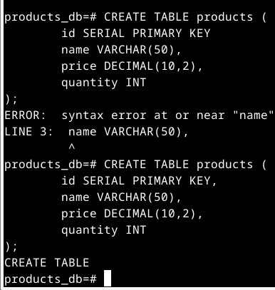
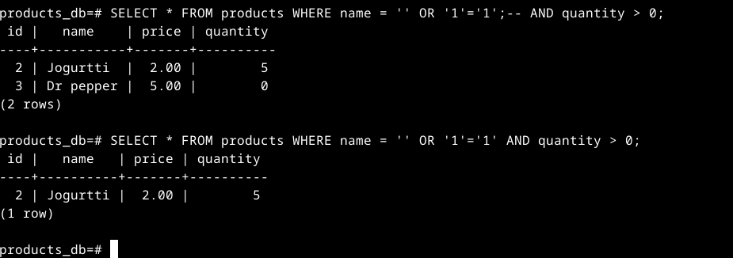

## a) CRUD. Tee uusi PostgreSQL-tietokanta ja demonstroi sillä create, read, update, delete (CRUD). Keksi taulujen ja kenttien nimet itse. Taulujen nimet monikossa, kenttien nimet yksikössä, molemmat englanniksi.

Asensin postgresql

	sudo apt install postgresql

Sen jälkeen kirjauduin postgres käyttäjälle ja loin uuden tietokannan, alkuun unohdin ; luonti komennon lopusta jonka takia komento ei mennyt läpi.

Loin uuden taulukon, siinäkin unohdin yhdestä kohtaa pilkun jonka takia ei mennyt ensimmäisellä yrittämällä läpi.

Lisäsin tuotteita tietokantaan.

Päivitin tuotteita.

Poistin tuotteita 

## b) SQLi me. Kuvaile yksinkertainen SQL-injektio, ja demonstroi se omaan tietokantaasi psql-komennolla. Selitä, mikä osa on käyttäjän syötettä ja mikä valmiina ohjelmassa. (Tässä harjoituksessa voit vain kertoa koodista, ei siis tarvitse välttämättä koodata sitä ohjelmaa, joka yhdistää käyttäjän syötteen SQL:n)

Voidaan kuvitetlla ohjelma joka ottaa suoraan käyttäjän syötteestä komennot mitä haetaan esimerkiksi

	SELECT * FROM products WHERE name = '" + syöte + "' AND quantity > 0;

Eli kuten aikaisempien viikkojen tehtävässä käytiin läpi jos syöte on syöte = ' OR '1'='1';-- niin tulostukseen tulisi kaikki tuotteet jotka ovat tietokannassa.

	SELECT * FROM products WHERE name = '' OR '1'='1';--' AND quantity > 0;

Eli tässä ei anneta anneta nimeä jota haetaan vaan annetaan "OR '1'='1'" jonka takia jompi kumpi lausekkeista käy, "'1'='1'" palauttaa Boolean TRUE arvon (Postgressissä pystyy myös kirjoittamaan pelkän TRUE), ";--" sulkee lausekkeen ja kommentoi loput lausekkeesta pois jolloin vaatimusta tuotteiden määrästä ei viimeistellä.

# PortSwiggerLabs

## d)

Vastaukseen riitti että kirjatumis kenttään laittoi administrator'--, administrator;-- ei käynyt jostain syystä käynyt joten veikkaan että liittyy käytettyyn tietokannan hallinta ohjelmaan?

## e) 

Jouduin katsomaan ohjetta ja vastauksen sai valitsemalla kategorian ja laittamalla "'+UNION+SELECT+BANNER,+NULL+FROM+v$version--" vastauksen löytäminen ilman tuntemusta Oraclen tietokanta järjestelmistä olisi ollut minulle mahdotonta.

## f) 

'UNION+SELECT+@@version,+NULL

## g) 

Vastauksessa piti etsiä käyttäjä ja salasana ja sen jälkeen hakea niillä tietokannasta käyttäjänimi sekä sen salasana.

## h)

Piti etsiä millä rivillä on dataa

## i) 

UNION+SELECT+username,+password+FROM+users--

Listasi käyttäjät sekä salasanat.

## j)
UNION+SELECT+NULL,username||'~'||password+FROM+users--

listasi käyttäjät ja salasanat vierekkäin.

## Lähteet: 

https://terokarvinen.com/2023/eettinen-hakkerointi-2023/
