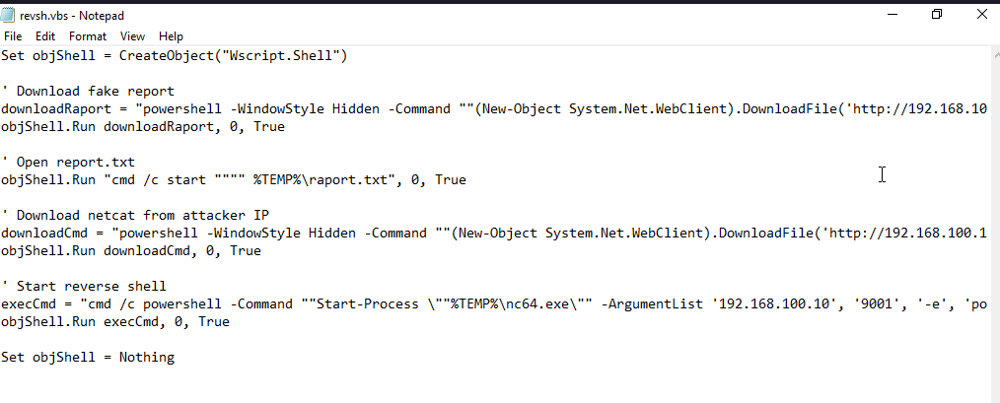
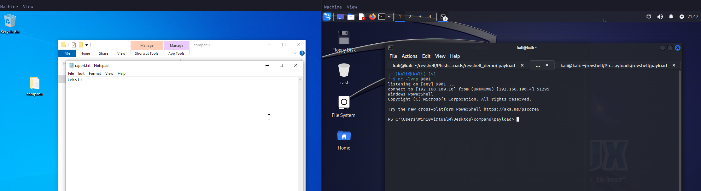
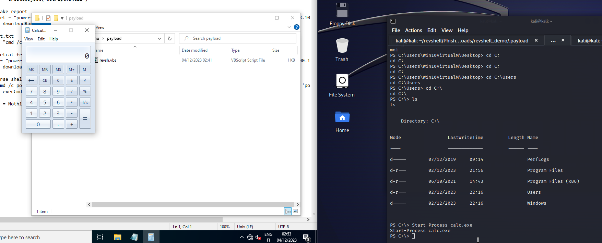

# H6
## x) 

### PhishSticks

Videoilla käydään läpi eri ominaisuuksia: keyloggeria, ransomwarea ja reverseshelliä. Gitissä löytyy lähdekoodit sekä demot PhishStickistä.

### MITRE FAQ 

Tactics: Miksi jokin asia tehdään.

Techniques: Kuinka asia tehdään.

Procedures: Askeleittain asian toteuttaminen.

## a) The OS pwns you. Asenna Windows virtuaalikoneeseen samaan verkkoon hyökkäyskoneen (esim. Kali, Debian) kanssa. Kokeile, että saat koneen irrotettua Internetistä.

Asensin windows 10, aluksi heitti bluescreeniä asennuksen yhteydessä mutta sain sen korjattua lisäämällä että käyttää hostin prosessoria -cpu host.

## b) 

Kopion PhishSticks githubin sisällöt molempiin sivuihin, sen jälkeen avasin Windowsin sekä Kalin siten että niillä on ytheys ainoastaan keskenään.

Muutin revsh.vbs koodia siten että siellä on hyökkäävän koneen IP osoite ja portti jota kone kuuntelee.

Kalissa loin raport.txt tiedoston jota hostasin nc64.exe lisäksi. Sen jälkeen laitoin Kalin kuuntelemaan porttia 9001 ja käynnistin "Company raport.lnk" tiedoston.

Sain reverse shell yhteyden ongelmitta Kali koneella

Avasin laskimen Windows koneella Kalista käsin ja pystyin myös selaamaan kansioita.

## c) 

### 1. Initial Access TA0001

Esimerkiksi PhishSticksissä on luotu USB tikku jossa on haittaohjelma (T1200), voidaan kuvitella samanlainen tilanne meidän VM koneella.

### 2. Execution TA0002

Se että käyttäjä ajaa haittaohjelman, se voi olla esimerkiksi peitetty yhtiön raportiksi jotta käyttäjä avaisi sen.

### 3. Persistence TA0003

Muutetaan haittaohjelma siten että se käynnistyy kun kone käynnistyy ilman että se esimerkiksi lataisi raport.txt tiedostoa. Skriptin voisi myös piilottaa muihin tiedostoihin, esimerkiksi pikakuvakkeisiin koneen työpöydällä.

### 4.Privilege Escalation TA0004

Luodaan uusia käyttäjiä ja annetaan niille admin oikeudet.

### 5. Defence Evasion TA0005

Piilotetaan tiedostot esimerkiksi nimiin jotka eivät herättäisi epäilystä esimerkiksi company raport ja uudet käyttäjät siten etteivät näkyisi hyökättävän koneen käyttäjälle aloitusruudussa  

## Lähteet:

https://terokarvinen.com/2023/eettinen-hakkerointi-2023/

https://www.oreilly.com/library/view/antivirus-bypass-techniques/9781801079747/

https://attack.mitre.org/techniques/T1200/

https://attack.mitre.org/techniques/T1059/001/

https://attack.mitre.org/tactics/TA0001/

https://attack.mitre.org/tactics/TA0002/

https://attack.mitre.org/tactics/TA0003/

https://attack.mitre.org/tactics/TA0004/

https://attack.mitre.org/tactics/TA0005/
