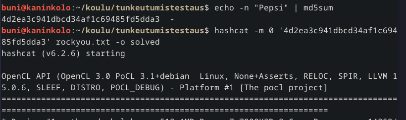
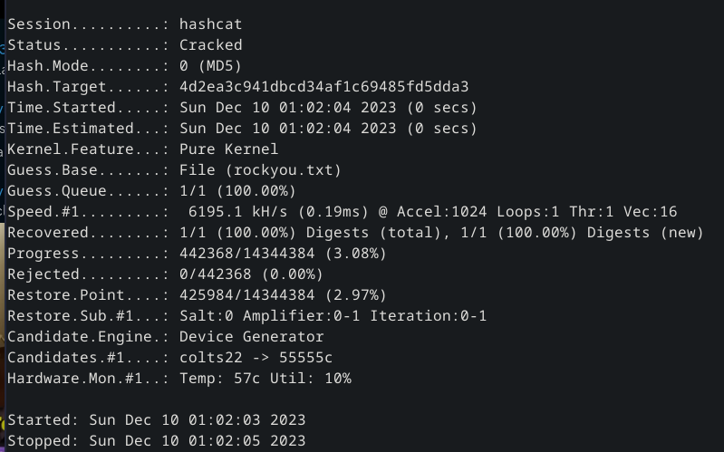
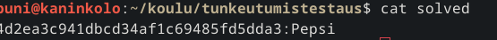
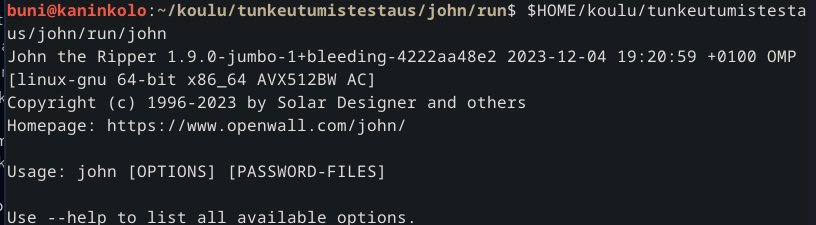
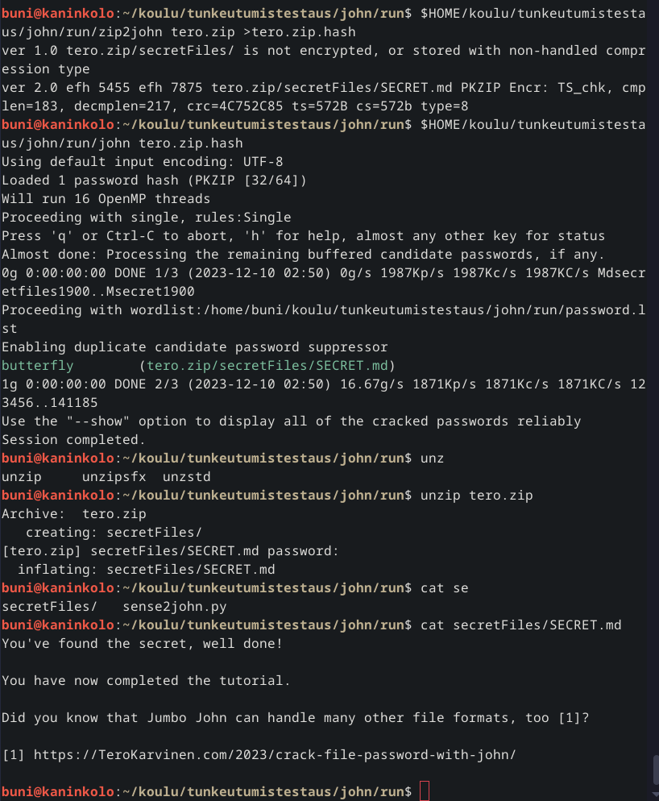
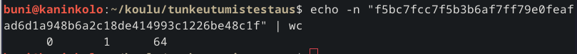
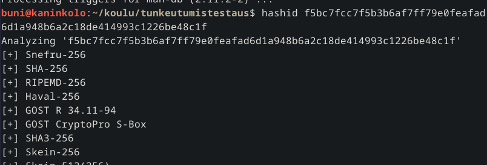
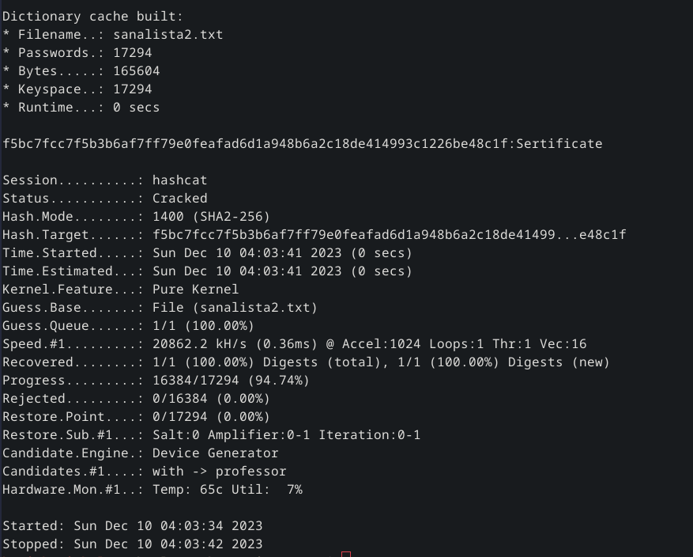

# H7

## x)

### Hashcat

	hashcat -m x <tiiviste> <sanalista> -o solved

- m x kertoo moodin miltä algoritmilta ratkaistaan tiivistettä, hashcatin manuaalista löytyy eri algoritmien numero

- tiiviste on salattu teksti jollain algoritmilla

- sanalista käy läpi listasta sanat/merkkijonojen tiivisteet ettei tarvitsisi bruteforcella arvata salasanaa

- o laittaa ratkaisun tiedostoon josta sen voi käydä katsomassa myöhemmin.

  
### John

Käydään läpi johntheripperin asennus suoraan gitistä ja kuinka se rakennetaan make:lla. 

Zippitiedoston salasanan tiivisteen irrottaminen:

	Johnin asennuskansio/john/run/zip2john esim.zip > esim.zip.hash

Johnin käyttö:

	Johnin asennuskansio/john/run/john esim.zip.hash

## a) 

Asensin Hashcatin Debianille

	sudo apt install hashcat

Kokeilin Hashcatia, latasin rockyou.txt tiedoston otin sen pois pakkauksesta, loin md5 tiivisteen ja sen jälkeen pystyin crackaamaan tiivisteestä salasanan.

## b) 

Asensin John the Ripperin, aluksi vaativuudet ja sen jälkeen kloonasin gitin, sen jälkeen pystyin rakentamaan ohjelman make:lla, testasin että ohjelma toimii tero.zip tiedostolla.

## c) 

Latasin Cewlin ja sen jälkeen pystyin lataamaan sanalistan teron sivuista

	cewl https://terokarvinen.com/2023/eettinen-hakkerointi-2023/ -m 4 -o sanalista.txt

määrittelin että ottaa huomioon ainoastaan yli 4 merkkiä pitkät sanat.

tiiviste oli "f5bc7fcc7f5b3b6af7ff79e0feafad6d1a948b6a2c18de414993c1226be48c1f", pystyin tarkistamaan tiivisteen merkkimäärän

	echo -n "f5bc7fcc7f5b3b6af7ff79e0feafad6d1a948b6a2c18de414993c1226be48c1f" | wc

Josta sain selville että se on todennäköisesti SHA-256 koska sillä on 64 merkkiä, kun taas esim. MD5 on 32.

Löysin myös ohjelman "hashid" jolla pystyy listaamaan eri tiivisteiden tunnisteita merkkijonon perusteella(edit. Tää olikin näköjään Teron hashcat sivulla linkattuna.)

Sen jälkeen pystyin cräckäämään salasanan hashcatin avulla

	hashcat -m 1400 -a 0 "f5bc7fcc7f5b3b6af7ff79e0feafad6d1a948b6a2c18de414993c1226be48c1f" sanalista2.txt

-m 1400 määrittelee ettö käytetään SHA-256 algoritmia. Eri algoritmien tunnisteet löytää manuaalista.

Siitä näkyy että salattu teksti oli "Sertificate"

## d) 

https://github.com/sawulohi/PenTest/tree/main/h6#c-attaaack-mitre-attack-enterprise-matrix-demonstroi-viisi-tekniikkaa-viidest%C3%A4-eri-taktiikasta

Valitsin tämän koska pidin sen loogisuudesta käydä läpi eri vaiheet ja kuinka tietoa on haettu palveluista jota oli kohde palvelimessa.

Aluksi skannattiin palvelin nmapilla, sieltä löyty palvelu jonka portit olivat avoinna. Sen jälkeen etsittiin tietoa palvelusta ja sen haavoittuvuuksista. Sen jälkeen pystyttiinkin menemään palvelimelle ja keräämään tietoja sieltä. Kyseessä oli NoSQL johon käy eri komennot kuin tyypilliseen SQL tietokantaan ja mutta silti sieltä saatiin haluamat tiedot. Lopuksi vielä Sawulohi oli poistanut tietokannan NoSQL komentojen avulla.

## e) Lähteet:

https://terokarvinen.com/2023/eettinen-hakkerointi-2023/

Hashcatin manuaali

https://terokarvinen.com/2022/cracking-passwords-with-hashcat/

https://terokarvinen.com/2023/crack-file-password-with-john/

https://github.com/sawulohi/PenTest/

https://terokarvinen.com/2023/crack-file-password-with-john/tero.zip
